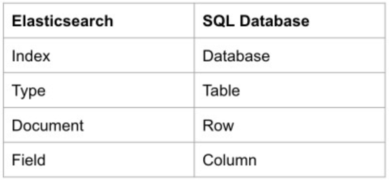

# What is MongoDB ?
MongoDB is a document database with the scalability and stores data in flexible, JSON-like documents, meaning fields can vary from document to document and data structure can be changed over time.
# What is ElasticSearch ?
Elasticsearch is a search engine based on Lucene.It uses a document-oriented approach when manipulating data which is stored in JSON format.
# Sounds similar , what's the difference?
Elasticsearch is a highly scalable open source full-text search and analytics engine, whereas MongoDB is next-generation database.Unlike MongoDB, ElasticSearch is not yet ready for use as main storage for data.
Elasticsearch is generally used as the underlying engine/technology that powers applications that have complex search features and requirements. MongoDB is not a search engine but it has full text search feature. 
example :  

# Who uses Elasticsearch?
eBay, Facebook, Uber, github, Microsoft, Just Eat, Google, Bing, Yahoo!, DuckDuckGo.

# Sync mongodb to elasticsearch

<h3 color="red">Mongodb-River:</h3>
unfortunately this plugin is not supporting the latest version of Elasticsearch but only support 1.7- and you are not lucky to use real time sync .

<h3 color="red">Mongo-connector:</h3>
A decent python based library, but unfortunately haven’t been updated for almost a two year, not to mention that it does not support Elasticsearch version 6+ out of the box, only support Elasticsearch 5-.

<h3 color="red">Transporter:</h3>
A great and updated frequently library, but it does not actually sync the data between mongodb and Elasticsearch in real time! Which means that it’s job is done once the sync is done. 

# What is Monstache ?
Monstache is a sync daemon written in Go that continuously indexes your MongoDB collections into Elasticsearch. Monstache gives you the ability to use Elasticsearch to do complex searches and aggregations of your MongoDB data and easily build realtime Kibana visualizations and dashboards. 
documentation for Monstache : https://rwynn.github.io/monstache-site/ 
github : https://github.com/rwynn/monstache

# What is MongoDB Replication?
A replica set is a group of mongod instances that maintain the same data set. A replica set contains several data bearing nodes and optionally one arbiter node. 
Of the data bearing nodes, one and only one member is deemed the primary node, while the other nodes are deemed secondary nodes. 
The primary node receives all write operations.  
A replica set can have only one primary capable of confirming writes with { w: "majority" } write concern; although in some circumstances, another mongod instance may transiently believe itself to also be primary. [1] The primary records all changes to its data sets in its operation log, i.e. oplog. For more information on primary node operation, see Replica Set Primary. 
<h3>replica set allow you to indexes your MongoDB collections into Elasticsearch en real time synchronization.</h3>
if you have a CRUD on Mongodb with this mode you don't should down the container to get this changement on elastic.
see : 
https://docs.mongodb.com/manual/core/replica-set-primary/ 
https://docs.mongodb.com/manual/reference/program/mongod/#bin.mongod 
https://docs.mongodb.com/manual/core/replica-set-primary/ 
https://docs.mongodb.com/manual/reference/replica-configuration/ 

